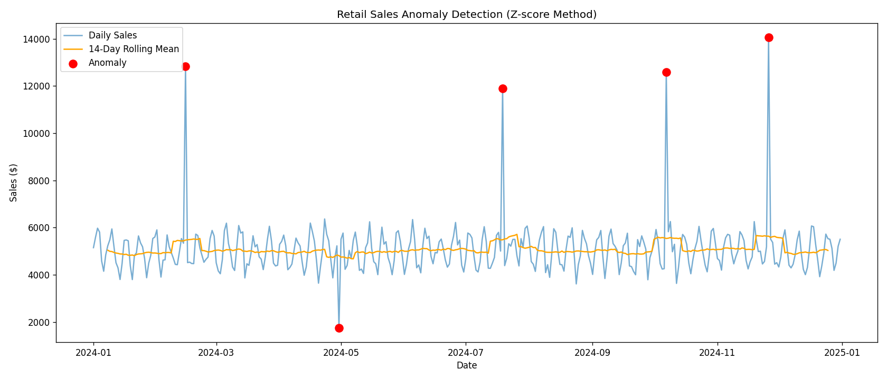

# Retail Sales Anomaly Detection

Detects unusual daily sales patterns using rolling statistics and Z-score thresholds. Built to demonstrate proactive KPI monitoring — the kind of analysis that catches data pipeline issues or genuine business outliers before they hit executive reports.

## What it does
- Generates (or loads) daily sales data
- Computes 14-day rolling mean and standard deviation
- Flags days where sales deviate >2.5 standard deviations from the rolling baseline
- Exports flagged anomalies to CSV for stakeholder review
- Produces a labeled visualization

## Tools
Python, Pandas, NumPy, Matplotlib

## Use case
At T-Mobile, anomaly detection logic of this type flagged a recurring data pipeline issue that was misreporting ~$180K in quarterly revenue across a sales region.

## Run
## 📊 Sample Output

### Anomaly Detection Visualization

---

### 📁 Output Data
Flagged anomalies are stored in:
- `flagged_anomalies.csv`
``
